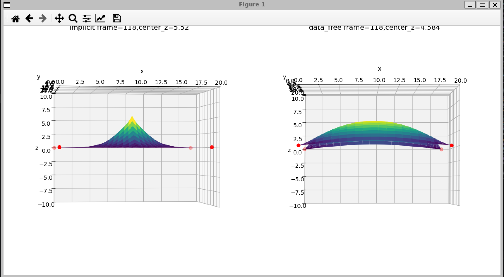

# Data-Free Learning of Reduced-Order Kinematics论文复现

## requirements

pytorch numpy scipy matplotlib

## 项目结构

cloth2d为2D弹簧质点网格，复杂系统用于测试静力学特征

cloth2d/plot.py 使用matplotlib展现仿真结果，下图是in_dim=20，iter=200k的结果

line1d为一维弹簧链，简单系统用于测试动力学特征

## 项目说明

line1d通过动力学模拟，证明了这种方法相比传统方法在动力学模拟上误差很大

cloth2d通过静力学模拟，证明了如果有没有在训练中考虑的外力，静力学迭代后这种方法误差很大

因此，我认为这篇论文的核心贡献是“无数据低维形变流形学习”，而不是“无数据物理仿真”。如果把它理解为仿真器，实验结果并不支持；如果把它理解为一种学习低能形变先验的方法，则仍然具有一定价值。